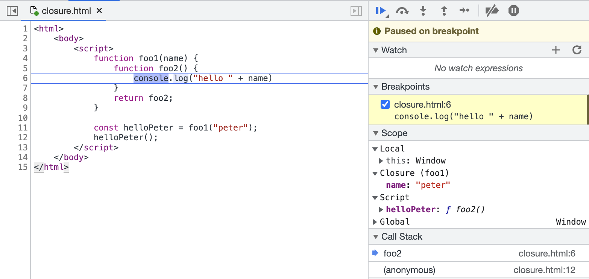
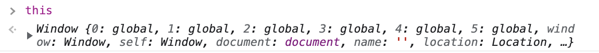

# 브라우저

## 웹 스토리지에 대해서 설명해주세요

HTML5에는 웹의 데이터를 브라우저에 저장할 수 있는 새 자료구조인 웹 스토리지(Web Storage)가 추가되었다고 합니다.
기존에 사용하던 쿠키와는 어떤 차이점이 있는걸까요?

### 웹 스토리지 VS 쿠키

어떠한 데이터를 저장한다는 맥락에서 비슷하지만 웹 스토리지는 쿠키를 단점을 극복하는 여러 요소가 있다고 합니다.

1. 쿠키를 설정하면 웹 요청을 할 때 쿠키 정보를 포함해서 전송됩니다. 하지만 웹 스토리지는 브라우저에서 존재할 뿐, 전송이 되지는 않습니다. 이러한 차이점 때문에 웹 스토리지는 네트워크 트래픽을 줄여준다는 장점이 있습니다.
2. 웹 스토리지는 문자열 기반 데이터 이외에도 객체 정보를 담을 수 있습니다. 브라우저의 지원 여부를 따져보아야 하지만, 사용하면 쿠키보다 개발 편의성이 높다는 것은 분명합니다.
3. 웹 스토리지는 용량의 제한이 없다고 합니다.
4. 웹 스토리지는 기본적으로 데이터가 영구히 저장됩니다.

### 로컬 스토리지와 세션 스토리지

웹 스토리지는 데이터의 지속성과 관련해서 두가지 저장소를 제공하는데요. 각각의 특징을 살펴보겠습니다.

#### 로컬 스토리지

1. 저장한 데이터를 의도적으로 지우지 않는 이상 계속 유지됩니다.
2. 도메인마다 별도로 로컬 스토리지가 생기기 때문에 같은 도메인의 탭이 여러개 열려있을 때 그 탭 내에서 로컬 스토리지는 공유됩니다.

#### 세션 스토리지

1. 브라우저가 종료되면 세션 스토리지의 내용은 삭제됩니다.
2. 같은 도메인이더라도, 탭이나 새 브라우저로 나눠져 있을 때는 공유되지 않습니다.

## 이벤트 루프에 대해서 설명해주세요

이벤트 루프는 콜백 큐에 있는 작업들을 하나씩 꺼내서 콜 스택에 넣어주는 루프를 말합니다.

**왜 이런일이 필요할까요?**

자바스크립트는 싱글 스레드 기반 언어입니다. 그런 이유로 한번에 하나씩 작업을 진행할 수밖에 없죠.

하지만 현대 웹 애플리케이션에서는 동시에 여러 작업을 할 일이 많습니다. 그런 여러 작업들을 그것을 자바스크립트 엔진으로만 진행하면 blocking 될 일이 많이 생기게 됩니다. 이런일을 방지하기 위해 이벤트 루프가 필요한데요. 자바스크립트 코드 처리 과정을 통해서 조금 더 상세하게 알아보겠습니다.

```javascript
function job0() {
  console.log("start");
}

function job1() {
  document.querySelector("button").addEventListener("click", () => {
    console.log("clicked");
  });
}

function job2() {
  console.log("end");
}

job0();
job1();
job2();
```

1. job0이 콜 스택에 올라가서 처리되고 없어집니다.
2. job1이 콜 스택에 올라가서 처리됩니다.
   1. button 태그의 click 이벤트를 감지할 때 까지 web Apis 에서 대기합니다.
   2. job1이 콜 스택에서 없어집니다.
3. job2가 콜 스택에 올라가서 처리되고 없어집니다.
4. 클릭 이벤트가 발생합니다.
5. web Apis에 있던 콜백 작업이 콜백 큐로 이동됩니다.
6. **이벤트 루프**는 콜 스택에 아무런 작업이 없으면 콜백 큐에 있는 작업을 콜 스택에 할당합니다.

이런 흐름으로 작업이 진행된다면 작업을 처리하고 있어도 다음 작업을 진행할 수 있게 됩니다.

정리하자면, 이벤트 루프는 web Apis를 통해 전달된 콜백들을 콜백 큐에서 꺼내 콜 스택에 넘겨주는 일을 하는 것입니다.

# 자바스크립트

## 호이스팅

함수 안에 있는 모든 선언들을 끌어올려 해당 함수 유효 범위의 최상단에 선언하는 것을 말합니다.

var와 함수 선언식을 대상으로만 호이스팅이 이루어집니다.

let, const 변수 선언과 함수 표현식에서는 호이스팅이 이루어지지 않습니다.

## 클로저 함수

선언된 환경을 기억하는 함수라고 말할 수 있습니다.



12번 줄에서 리턴받은 함수는 선언될 당시에 그 부모 스코프(사진에서 "Closure(foo1)" )를 가지고 있기 때문에 name에 접근할 수 있습니다.

요약하자면 foo2의 상위 스코프를 결정한 이후에는 foo2와 상관없는 곳에서 호출한다 하더라도 foo2의 상위 스코프를 탐색하게 됩니다.

이러한 특성을 이용하면

클로저가 포함된 함수의 변수는 직접 변경이 불가능하게 되기 때문에, private한 멤버 변수가 있는 클래스를 사용하는 것처럼 효과를 낼 수 있습니다.

## this

this는 함수의 호출 방식에 따라서 다른 값이 바인딩됩니다. 그 호출 방식에 대해서 알아보겠습니다.

### 그냥 this를 호출했을 때

브라우저 환경을 기준으로, 기본적으로 this에는 전역 객체(global)이 바인딩됩니다.


### 일반 함수를 호출했을 때

함수를 호출하면 this에 전역객체가 바인딩됩니다.

하지만 엄격 모드에서는 undefined가 바인딩됩니다.

### 메소드를 호출했을 때

객체 내부의 함수 즉, 메서드를 호출하면 메서드가 속한 객체가 바인딩됩니다.

```javascript
var account = {
  id: "cat",
  password: "ilovecat",
  getIdPassword: function () {
    return `${this.id}, ${this.password}`;
  },
};

account.getIdPassword(); // "cat, ilovecat"
```

### 이벤트 핸들러에 전달된 콜백 함수를 호출했을 때

이벤트 핸들러에서 this는 이벤트가 발생한 해당 요소가 바인딩됩니다.

```javascript
var submit = document.querySelector("#submit");

submit.addEventListener("click", function () {
  console.log(this); // #submit
});
```

### 생성자 함수 호출

생성자 함수를 호출하면 아래와 같은 방식으로 this가 바인딩됩니다.

생성자 함수의 호출 과정

1. 빈 객체 생성 및 this에 생성한 객체를 바인딩
2. this를 이용해서 프로퍼티 생성
3. 생성된 객체 반환

```javascript
function Person(name) {
  this.name = name;
}

const jo = new Person("jo");
const park = new Person("park");

jo.name; // "jo"
park.name; // "park"
```

### apply/call/bind 호출

applt, call, bind 함수를 사용하면 this에 원하는 값을 바인딩할 수 있습니다.

## 일반함수와 화살표함수의 차이점

## 이벤트 버블링, 캡쳐링, 위임

# 리액트

## 리스트를 구성할 때 key 값으로 고유한 id를 사용해야 한다. 왜 index를 사용하면 안되는 것인가?

## React Hooks의 의존성 관련 질문

# CSS

## CSS margin, padding 차이점
