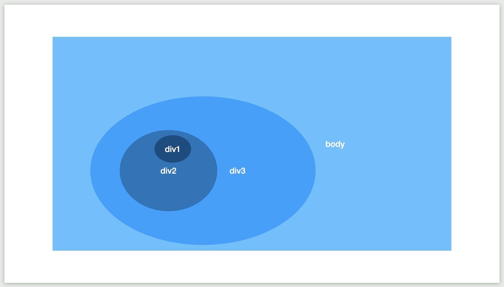

# 프론트엔드 개발자 기본 지식 정리

1. [브라우저](#브라우저)
   - [웹 스토리지](#웹-스토리지)
   - [이벤트 루프](#이벤트-루프)
2. [자바스크립트](#자바스크립트)
   - [호이스팅](#호이스팅)
   - [클로저 함수](#클로저-함수)
   - [this](#this)
   - [일반 함수와 화살표 함수의 차이점](#일반-함수와-화살표-함수의-차이점)
   - [이벤트 버블링, 캡쳐링, 위임](#이벤트-버블링-캡쳐링-위임)
3. [리액트](#리액트)
4. [CSS](#css)
   - [CSS margin, padding 차이점](#css-margin-padding-차이점)
   - [box-sizing: border-box](#box-sizing-border-box)
5. [HTML5](#html5)
   - [시맨틱 태그](#시맨틱-태그)

# 브라우저

## 웹 스토리지

HTML5에는 웹의 데이터를 브라우저에 저장할 수 있는 새 자료구조인 웹 스토리지(Web Storage)가 추가되었다고 합니다.
기존에 사용하던 쿠키와는 어떤 차이점이 있는걸까요?

### 웹 스토리지 VS 쿠키

어떠한 데이터를 저장한다는 맥락에서 비슷하지만 웹 스토리지는 쿠키를 단점을 극복하는 여러 요소가 있다고 합니다.

1. 쿠키를 설정하면 웹 요청을 할 때 쿠키 정보를 포함해서 전송됩니다. 하지만 웹 스토리지는 브라우저에서 존재할 뿐, 전송이 되지는 않습니다. 이러한 차이점 때문에 웹 스토리지는 네트워크 트래픽을 줄여준다는 장점이 있습니다.
2. 웹 스토리지는 문자열 기반 데이터 이외에도 객체 정보를 담을 수 있습니다. 브라우저의 지원 여부를 따져보아야 하지만, 사용하면 쿠키보다 개발 편의성이 높다는 것은 분명합니다.
3. 웹 스토리지는 용량의 제한이 없다고 합니다.
4. 웹 스토리지는 기본적으로 데이터가 영구히 저장됩니다.

### 로컬 스토리지와 세션 스토리지

웹 스토리지는 데이터의 지속성과 관련해서 두가지 저장소를 제공하는데요. 각각의 특징을 살펴보겠습니다.

#### 로컬 스토리지

1. 저장한 데이터를 의도적으로 지우지 않는 이상 계속 유지됩니다.
2. 도메인마다 별도로 로컬 스토리지가 생기기 때문에 같은 도메인의 탭이 여러개 열려있을 때 그 탭 내에서 로컬 스토리지는 공유됩니다.

#### 세션 스토리지

1. 브라우저가 종료되면 세션 스토리지의 내용은 삭제됩니다.
2. 같은 도메인이더라도, 탭이나 새 브라우저로 나눠져 있을 때는 공유되지 않습니다.

## 이벤트 루프

이벤트 루프는 콜백 큐에 있는 작업들을 하나씩 꺼내서 콜 스택에 넣어주는 루프를 말합니다.

**왜 이런일이 필요할까요?**

자바스크립트는 싱글 스레드 기반 언어입니다. 그런 이유로 한번에 하나씩 작업을 진행할 수밖에 없죠.

하지만 현대 웹 애플리케이션에서는 동시에 여러 작업을 할 일이 많습니다. 그런 여러 작업들을 그것을 자바스크립트 엔진으로만 진행하면 blocking 될 일이 많이 생기게 됩니다. 이런일을 방지하기 위해 이벤트 루프가 필요한데요. 자바스크립트 코드 처리 과정을 통해서 조금 더 상세하게 알아보겠습니다.

```javascript
function job0() {
  console.log("start");
}

function job1() {
  document.querySelector("button").addEventListener("click", () => {
    console.log("clicked");
  });
}

function job2() {
  console.log("end");
}

job0();
job1();
job2();
```

1. job0이 콜 스택에 올라가서 처리되고 없어집니다.
2. job1이 콜 스택에 올라가서 처리됩니다.
   1. button 태그의 click 이벤트를 감지할 때 까지 web Apis 에서 대기합니다.
   2. job1이 콜 스택에서 없어집니다.
3. job2가 콜 스택에 올라가서 처리되고 없어집니다.
4. 클릭 이벤트가 발생합니다.
5. web Apis에 있던 콜백 작업이 콜백 큐로 이동됩니다.
6. **이벤트 루프**는 콜 스택에 아무런 작업이 없으면 콜백 큐에 있는 작업을 콜 스택에 할당합니다.

이런 흐름으로 작업이 진행된다면 작업을 처리하고 있어도 다음 작업을 진행할 수 있게 됩니다.

정리하자면, 이벤트 루프는 web Apis를 통해 전달된 콜백들을 콜백 큐에서 꺼내 콜 스택에 넘겨주는 일을 하는 것입니다.

# 자바스크립트

## 호이스팅

함수 안에 있는 모든 선언들을 끌어올려 해당 함수 유효 범위의 최상단에 선언하는 것을 말합니다.

var와 함수 선언식을 대상으로만 호이스팅이 이루어집니다.

let, const 변수 선언과 함수 표현식에서는 호이스팅이 이루어지지 않습니다.

## 클로저 함수

선언된 환경을 기억하는 함수라고 말할 수 있습니다.


12번 줄에서 리턴받은 함수는 선언될 당시에 그 부모 스코프(사진에서 "Closure(foo1)" )를 가지고 있기 때문에 name에 접근할 수 있습니다.

요약하자면 foo2의 상위 스코프를 결정한 이후에는 foo2와 상관없는 곳에서 호출한다 하더라도 foo2의 상위 스코프를 탐색하게 됩니다.

이러한 특성을 이용하면

클로저가 포함된 함수의 변수는 직접 변경이 불가능하게 되기 때문에, private한 멤버 변수가 있는 클래스를 사용하는 것처럼 효과를 낼 수 있습니다.

## this

this는 함수의 호출 방식에 따라서 다른 값이 바인딩됩니다. 그 호출 방식에 대해서 알아보겠습니다.

### 그냥 this를 호출했을 때

브라우저 환경을 기준으로, 기본적으로 this에는 전역 객체(global)이 바인딩됩니다.


### 일반 함수를 호출했을 때

함수를 호출하면 this에 전역객체가 바인딩됩니다.

하지만 엄격 모드에서는 undefined가 바인딩됩니다.

### 메소드를 호출했을 때

객체 내부의 함수 즉, 메서드를 호출하면 메서드가 속한 객체가 바인딩됩니다.

```javascript
var account = {
  id: "cat",
  password: "ilovecat",
  getIdPassword: function () {
    return `${this.id}, ${this.password}`;
  },
};

account.getIdPassword(); // "cat, ilovecat"
```

### 이벤트 핸들러에 전달된 콜백 함수를 호출했을 때

이벤트 핸들러에서 this는 이벤트가 발생한 해당 요소가 바인딩됩니다.

```javascript
var submit = document.querySelector("#submit");

submit.addEventListener("click", function () {
  console.log(this); // #submit
});
```

### 생성자 함수 호출

생성자 함수를 호출하면 아래와 같은 방식으로 this가 바인딩됩니다.

생성자 함수의 호출 과정

1. 빈 객체 생성 및 this에 생성한 객체를 바인딩
2. this를 이용해서 프로퍼티 생성
3. 생성된 객체 반환

```javascript
function Person(name) {
  this.name = name;
}

const jo = new Person("jo");
const park = new Person("park");

jo.name; // "jo"
park.name; // "park"
```

### apply/call/bind 호출

applt, call, bind 함수를 사용하면 this에 원하는 값을 바인딩할 수 있습니다.

## 일반 함수와 화살표 함수의 차이점

일반 함수와 화살표 함수는 세가지 측면에서 차이점이 존재합니다.

### this

일반 함수의 경우에는 [this](#this) 섹션에서 정리한 규칙대로 동적으로 this 바인딩이 이루어집니다. 하지만 화살표 함수의 경우에는 언제나 상위 스코프의 this를 가리키게 됩니다. 또한 명시적으로 this를 바꿀수도 없습니다.

### 생성자 함수로 사용 가능 여부

일반 함수는 생성자 함수로 사용이 가능하지만, 화살표 함수는 생성자 함수로 사용이 불가능합니다. prototype 프로퍼티를 가지고있지 않기 때문입니다.

### arguments 사용 가능 여부

일반 함수에서는 암묵적으로 arguments가 전달되어 사용이 가능하지만, 화살표 함수는 전달되지 않습니다.

## 이벤트 버블링, 캡쳐링, 위임

브라우저가 이벤트를 감지하는 방법은 두가지가 있습니다.

### 이벤트 버블링



이벤트 버블링은 특정 요소에서 이벤트가 발생했을 때 해당 이벤트가 상위의 요소로 전달되어 올라가는 것을 뜻합니다. 거품이 뽀글뽀글 올라간다고 해서 버블링이라는 단어가 붙혀졌다고 합니다.

### 이벤트 캡쳐링

이벤트 캡쳐링은 버블링과는 반대 방향으로 진행되는 이벤트 전파 방식입니다. 최상위 요소부터 이벤트가 발생한 요소까지 차례로 찾아 내려가는 이벤트 전파 방식입니다.

### 이벤트 버블링, 캡쳐링 방지

원하는 화면 요소의 이벤트만 신경쓰고 싶다면 event.stopPropagation()를 사용하면 됩니다.

버블링의 경우에는 클릭한 요소의 이벤트만 발생되고, 캡쳐링의 경우에는 클릭한 요소의 최상위 요소의 이벤트만 발생시킵니다.

```javascript
event.stopPropagation();
```

### 이벤트 위임

각각의 하위 요소에 이벤트를 붙히지 않고 상위 요소에서 하위 요소들의 이벤트를 제어하는 방식입니다.

투두리스트를 예시로 들 수 있을 것 같은데요.

```javascript
var todoItems = document.querySelectorAll(".todo-item");

todoItems.forEach(function (todoItem) {
  todoItem.addEventListener("click", function (event) {
    alert("clicked");
  });
});
```

이렇게 현재 화면에 표시된 모든 아이템에 클릭 이벤트를 등록하는 코드가 있다고 가정하겠습니다. 이 상황에서 만약, 아이템이 하나 더 추가된다면 어떻게 될까요? 위 forEach 코드를 다시 실행해서 추가된 아이템에도 클릭 이벤트를 달아주어야 할 것입니다.

이때 이벤트 버블링 떠올린다면 문제를 쉽게 해결할 수 있는데요.

한 아이템에서 클릭 이벤트가 발생하면 이벤트 버블링의 특성으로 인해 해당 아이템의 상위 요소로 이벤트가 전파될 것입니다.

그냥 상위 요소에서 클릭 이벤트를 처리하면 어떨까요?

위 forEach 코드를 다시 돌리지 않아도 추가된 아이템에 클릭 처리를 추가할 수 있게 될 것입니다.

이러한 프로그래밍 방식이 이벤트 위임입니다.

# 리액트

## 리액트를 왜 쓰나요?

## 리스트를 구성할 때 key 값으로 고유한 id를 사용해야 한다. 왜 index를 사용하면 안되는 것인가?

## React Hooks의 의존성 관련 질문

# CSS

## CSS margin, padding 차이점

박스 모델을 기준으로 border와 content 사이에 있는 것은 **padding**

박스 모델을 기준으로 border 바깥쪽에 있는 공간을 **margin**

## box-sizing: border-box

width를 200px로 지정하고 padding을 20px로 지정했다고 가정하겠습니다. 이럴 때 실제 width는 240px로 잡히게 되는데요. 전체적인 width를 200px로 유지하고 padding을 설정하고 싶다면 어떠한 속성을 쓰나요?

# HTML5

## 시맨틱 태그

의미가 있는 태그라는 뜻입니다.

마크업을 작성할 때 div에 class를 달아서 사용해도 큰 무리가 없습니다. 하지만 현대 웹 개발에서는 시맨틱 태그를 준수하며 작성하는게 중요해졌는데요. 왜 그럴까요?

### 검색엔진 최적화

검색엔진이 제작한 웹 페이지의 마크업을 읽고 판단하여 검색결과로 띄워줄 수 있게 된다.

### 웹 접근성

스크린리더나 키보드로 브라우저를 이용하는 경우 문제없이 작동되게 만들어준다.

### 유지보수성

개발자에게 의미가 있는 정보를 전달해 유지보수 용이성을 높힐 수 있다.
